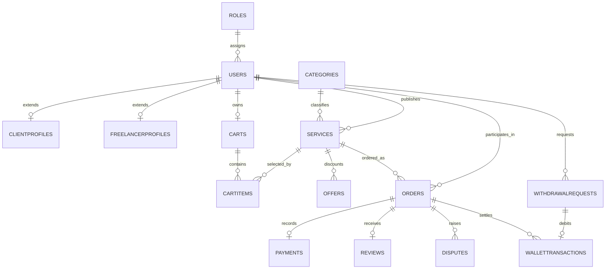

# SkillHub - Database Foundation and Authentication Module

**Project:** SkillHub, a C# Windows Forms marketplace for software-development services  
**Module owner:** MD. Nazmus Sakib  
**Student ID:** 24-58148-2  
**Course:** Object Oriented Programming 2, Section D  
**Assigned branch:** `feature/database-foundation`  
**Target:** Visual Studio 2022, .NET Framework 4.8, SQL Server LocalDB or Express

This repository contains Sakib's complete assigned foundation. It supplies the
shared SQL Server database, solution structure, account models, secure
authentication, role-aware session management, working landing pages, and an
individual account/profile CRUD demonstration. Sadman, Anika, and Omi retain
ownership of their respective freelancer, client, and admin/finance modules.

## Completed scope

- One buildable Visual Studio solution targeting .NET Framework 4.8.
- One configurable ADO.NET SQL Server connection shared across all modules.
- Sixteen normalized tables with primary keys, foreign keys, check constraints,
  useful indexes, integration views, and integrity triggers.
- Three role records, thirteen software-service categories, a configurable
  10-percent commission setting, and three hashed-password demonstration users.
- Public registration for Client and Freelancer accounts only.
- Email/password login and separate Client, Freelancer, and Admin dashboards.
- Shared signed-in user ID, role, email, name, and legacy role alias.
- Password hashing with PBKDF2-SHA256, a random salt, and 120,000 iterations.
- Profile viewing and editing, current-password verification, and logout.
- Complete DataGridView account CRUD: create, read/search, update, and soft
  deactivate while preserving transaction history.
- Connection-error handling, unique-email enforcement, protected administrator
  access, and role-specific profile/cart creation in one SQL transaction.

## Quick start

1. Install Visual Studio 2022 with the **.NET desktop development** workload and
   the **.NET Framework 4.8 targeting pack**.
2. Ensure SQL Server LocalDB is installed. The default instance is
   `(localdb)\MSSQLLocalDB`.
3. Open SQL Server Management Studio or Visual Studio's **SQL Server Object
   Explorer**, and connect to `(localdb)\MSSQLLocalDB`.
4. Open and execute the entire file `Database/SkillHubDatabase.sql`.
5. Execute `Database/SkillHub_Verification.sql` and confirm all `PASS` messages.
6. Open `SkillHub.sln` in Visual Studio.
7. Confirm the connection string in `App.config` matches the SQL Server instance
   on your computer.
8. Build the solution with **Build > Rebuild Solution**.
9. Press **F5**, optionally click **Test Database Connection**, and log in using
   one of the demonstration accounts below.

### Default LocalDB configuration

```xml
<connectionStrings>
  <add name="SkillHubConnection"
       connectionString="Data Source=(localdb)\MSSQLLocalDB;Initial Catalog=SkillHubDB;Integrated Security=True;Connect Timeout=15;TrustServerCertificate=True"
       providerName="System.Data.SqlClient" />
</connectionStrings>
```

For SQL Server Express, replace only `Data Source=(localdb)\MSSQLLocalDB` with
`Data Source=.\SQLEXPRESS` or the actual instance shown in SQL Server Object
Explorer. Keep `Initial Catalog=SkillHubDB` unchanged.

## Demonstration accounts

| Canonical role | Email | Password | Destination |
| --- | --- | --- | --- |
| Admin | `admin@skillhub.local` | `Admin@123` | Platform Admin Dashboard |
| Freelancer | `freelancer@skillhub.local` | `Freelancer@123` | Freelancer Dashboard |
| Client | `client@skillhub.local` | `Client@123` | Client Dashboard |

These credentials are for a local academic demonstration only. The SQL script
stores PBKDF2 hashes, not these plaintext passwords. Change or remove seeded
credentials before any deployment outside the classroom.

## Role naming and compatibility

The supplied project outline defines canonical names in `dbo.Roles`. Earlier
team discussions also used `SUPER_ADMIN`, `ADMIN`, and `CUSTOMER`. Both naming
systems are supported without duplicating or confusing account roles:

| Database `Roles.RoleName` | `UserSession.RoleName` | `UserSession.UserType` | Meaning |
| --- | --- | --- | --- |
| `Admin` | `Admin` | `SUPER_ADMIN` | Platform owner / super administrator |
| `Freelancer` | `Freelancer` | `ADMIN` | Service provider / shop-owner equivalent |
| `Client` | `Client` | `CUSTOMER` | Customer purchasing a service |

Use `RoleName` and `UserRoles` for new C# code. Use `UserType` only when
integrating a teammate's older naming convention. **Database `Admin` is not the
same thing as legacy `ADMIN`; legacy `ADMIN` means Freelancer.**

## Repository structure

```text
SkillHub.sln
SkillHub.csproj
App.config
Program.cs
Data/
  DatabaseConnection.cs
Database/
  SkillHubDatabase.sql
  SkillHub_Verification.sql
Documentation/
  TEAM_HANDOFF.md
  AUTH_TEST_CASES.md
Forms/
  Common/
    DashboardFormBase.cs
    FrmAccountManager.cs
    FrmChangePassword.cs
    FrmLogin.cs
    FrmProfile.cs
    FrmRegister.cs
    UiFactory.cs
  Admin/
    FrmAdminDashboard.cs
  Client/
    FrmClientDashboard.cs
  Freelancer/
    FrmFreelancerDashboard.cs
Models/
  Admin.cs
  Client.cs
  Freelancer.cs
  User.cs
  UserRoles.cs
Repositories/
  UserRepository.cs
Services/
  AuthenticationService.cs
  AuthorizationService.cs
Utilities/
  InputValidator.cs
  PasswordHasher.cs
  UserSession.cs
```

## Database entities

| Table | Primary key | Responsibility |
| --- | --- | --- |
| `Roles` | `RoleId` | Canonical Admin, Freelancer, and Client role lookup |
| `Users` | `UserId` | Common login, identity, status, and password hash |
| `ClientProfiles` | `UserId` | One-to-one client-specific profile |
| `FreelancerProfiles` | `UserId` | Professional profile, verification, and rating |
| `Categories` | `CategoryId` | Thirteen approved software-service categories |
| `Services` | `ServiceId` | Freelancer listings, pricing, delivery, and slots |
| `Offers` | `OfferId` | Platform-wide or service-specific discount offers |
| `Carts` | `CartId` | Exactly one persistent cart per client |
| `CartItems` | `CartItemId` | Unique cart/service lines and quantities |
| `Orders` | `OrderId` | Client/freelancer/service and financial snapshots |
| `Payments` | `PaymentId` | One simulated payment record per order |
| `WalletTransactions` | `WalletTxnId` | Freelancer credits, withdrawals, and adjustments |
| `WithdrawalRequests` | `WithdrawalId` | Simulated withdrawal approval workflow |
| `Reviews` | `ReviewId` | One verified, 1-5-star review per completed order |
| `Disputes` | `DisputeId` | Cancellation/dispute ownership and resolution |
| `PlatformSettings` | `SettingKey` | Configurable commission and platform settings |

### Relationship overview



### Shared integration views

- `dbo.vw_UserAccounts`: safe account listing with both canonical and legacy
  role labels; password hashes are intentionally excluded.
- `dbo.vw_ServiceCatalog`: joined freelancer, category, verification, rating,
  price, delivery, and service-capacity data.
- `dbo.vw_OrderFinancialSummary`: order participants, price snapshots,
  commissions, freelancer earnings, and simulated payment status.
- `dbo.vw_FreelancerWalletBalances`: ledger balance, pending withdrawal amount,
  and genuinely available balance for every freelancer.

## Shared C# integration contract

Every teammate must reuse the same classes:

```csharp
using System.Data;
using System.Data.SqlClient;
using SkillHub.Data;
using SkillHub.Models;
using SkillHub.Services;
using SkillHub.Utilities;

AuthorizationService.DemandRole(UserRoles.Freelancer);

int currentFreelancerId = UserSession.UserId;
DatabaseConnection database = new DatabaseConnection();

using (SqlConnection connection = database.OpenConnection())
using (SqlCommand command = new SqlCommand(
    "SELECT ServiceId, Title, Price, AvailableSlots "
    + "FROM dbo.Services WHERE FreelancerId = @FreelancerId;",
    connection))
{
    DatabaseConnection.AddParameter(
        command,
        "@FreelancerId",
        SqlDbType.Int,
        currentFreelancerId);

    using (SqlDataAdapter adapter = new SqlDataAdapter(command))
    {
        DataTable services = new DataTable();
        adapter.Fill(services);
        servicesDataGridView.DataSource = services;
    }
}
```

Do not create a second connection string, second database, custom session
class, hardcoded account ID, string-concatenated SQL statement, or public Admin
registration form.

### Required order statuses

```text
Pending Payment -> Placed -> In Progress -> Delivered -> Completed
                                       \-> Disputed -> Completed / Refunded
Placed -> Cancelled
```

Use exactly these values: `Pending Payment`, `Placed`, `In Progress`,
`Delivered`, `Completed`, `Disputed`, `Cancelled`, and `Refunded`.

### Financial example

For a BDT 5,000 order with the default 10% commission:

```text
GrossAmount        = 5000.00
CommissionRate     = 10.00
CommissionAmount   = 500.00
FreelancerEarning  = 4500.00
```

Money is `DECIMAL(18,2)` in SQL and must be `decimal` in C#. Historical
commission and price values belong on `Orders`; never recalculate an old order
from a changed current service price or commission setting.

## Sakib's account CRUD demonstration

1. Run `Database/SkillHub_Verification.sql` and show all tables and role seeds.
2. Start the application and log in as `admin@skillhub.local`.
3. Open **Account / Profile CRUD** from the Admin Dashboard.
4. **Create:** enter a new Client or Freelancer and a valid strong password;
   show the new row in the `DataGridView` and `dbo.Users`.
5. **Read:** search by the new account name or email; explain the joined
   canonical role and legacy user type.
6. **Update:** select the row, change its full name, phone, or email, and show
   the updated grid/database record.
7. **Deactivate:** select the same test account, confirm deactivation, and show
   that its status becomes `Deactivated` instead of deleting history.
8. Attempt to log in with the deactivated account and show the rejection.
9. Trigger one invalid email, duplicate email, or weak-password validation
   error and show that no invalid account reaches the database.
10. Log in with each seeded role and show its separate authorized dashboard.

## Team ownership and branches

| Member | Branch | Owned module | Foundation handoff |
| --- | --- | --- | --- |
| MD. Nazmus Sakib | `feature/database-foundation` | Database, authentication, session, profiles, account CRUD, integration | Complete in this repository |
| Sadman | `feature/freelancer-services` | Freelancer profile, service CRUD, capacity, order processing, wallet | Attach screens to `FrmFreelancerDashboard` |
| Anika | `feature/client-orders` | Discovery, filters, cart CRUD, checkout, orders, reviews, disputes | Attach screens to `FrmClientDashboard` |
| Omi / Aumi | `feature/admin-finance` | Categories/offers, moderation, disputes, withdrawals, platform finance | Attach screens to `FrmAdminDashboard` |

Start every feature branch from the same integrated foundation. Add new forms
through Visual Studio so the `.csproj` receives the correct entries. Nobody
should modify someone else's form or introduce a second project entry point.

## Validation and troubleshooting

- **Cannot connect:** ensure LocalDB/Express is running, rerun
  `Database/SkillHubDatabase.sql`, and correct only `Data Source` in
  `App.config`.
- **Missing database:** execute the *entire* SQL script, including every `GO`
  batch, against a server where you can create `SkillHubDB`.
- **Login rejected:** verify the exact demonstration credentials and that
  `Users.Status` is `Active`.
- **Duplicate email:** use a different address; `dbo.Users.Email` is unique.
- **Wrong dashboard:** inspect `dbo.Roles.RoleName`; do not confuse canonical
  `Admin` with the legacy `ADMIN` alias.
- **.NET Framework build error:** install the .NET Framework 4.8 targeting pack
  and `.NET desktop development` workload.
- **Form file conflict:** each teammate edits only their own module folder.
- **Role-guard error:** use `UserSession.UserId` and the correct account role in
  inserted foreign keys.

For module-by-module integration details, read
[`Documentation/TEAM_HANDOFF.md`](Documentation/TEAM_HANDOFF.md). For
reproducible authentication and account-CRUD tests, read
[`Documentation/AUTH_TEST_CASES.md`](Documentation/AUTH_TEST_CASES.md).

## Scope boundary

This foundation intentionally does not pretend to implement Sadman's service
CRUD, Anika's checkout/cart interfaces, or Omi's complete financial-management
screens. Their authorized landing pages, schemas, seed data, shared
authentication, database access, and integration contracts are ready; each
teammate must add the UI and business logic assigned to their own branch.
