# SkillHub – Freelance Marketplace Management System

## Project Overview

**SkillHub** is a complete academic desktop freelance marketplace for software-development and technology-related services. The platform connects clients with freelancers through visual service discovery, ordering, simulated payment, project delivery, reviews, disputes, earnings, and platform administration.

The project is implemented as a **C# WinForms desktop application with SQL Server database integration** for the Object Oriented Programming 2 (OOP2) course.

## Quick Start

1. Open SQL Server Management Studio and execute `Database/SkillHubDatabase.sql` in full.
2. Execute `Database/SkillHub_Verification.sql` and confirm that every check prints `PASS`.
3. Open `SkillHub.sln` in Visual Studio 2022 on Windows.
4. If SQL Server Express is not named `.\SQLEXPRESS`, update only the `Data Source` value in `App.config`.
5. Build the solution and run the application.

### Primary demonstration accounts

| Role | Email | Password |
|---|---|---|
| SUPER_ADMIN | `admin@skillhub.local` | `Admin@123` |
| Freelancer / ADMIN | `freelancer@skillhub.local` | `Freelancer@123` |
| Client / CUSTOMER | `client@skillhub.local` | `Client@123` |

Additional freelancer accounts use `Freelancer@123`: `ayesha@skillhub.local`, `tanvir@skillhub.local`, `nusrat@skillhub.local`, `farhan@skillhub.local`, and `samira@skillhub.local`.

Additional client accounts use `Client@123`: `mahin.client@skillhub.local`, `tasnim.client@skillhub.local`, and `arif.client@skillhub.local`.

## Refined Marketplace Experience

- Six seeded freelancers with professional biographies, skills, ratings, profile portraits and thirteen complete service listings
- Four seeded clients, each with an automatically created personal cart
- Visual service cards with local offline images, freelancer portraits, verification, category, rating, price, delivery and availability
- Live keyword search across services, descriptions, freelancers, categories and skills
- Category filtering and sorting by recommendation, rating, price, delivery time or newest listing
- A complete service detail screen with the full service description and freelancer information
- Freelancer-controlled profile photo and service image selection with safe visual fallbacks
- Restyled shared dashboards, rounded cards and consistent marketplace colors across all roles

---

## Project Domain

SkillHub mainly focuses on software and technology services such as:

- Full-Stack Development
- Frontend Development
- Backend Development
- C# / .NET Desktop Development
- Android Application Development
- iOS Application Development
- Rust / Firmware Development
- QA / Software Testing
- Data Analysis
- Cybersecurity
- UI/UX Design
- Graphic Design

---

## Case Story

Nabila Rahman is a small business owner who needs an inventory management application. Instead of searching through scattered social-media posts and unreliable portfolios, she uses SkillHub to search for a suitable C# desktop application developer.

Rafi Ahmed is a freelance software developer who offers C# and .NET development services through SkillHub. Nabila reviews his service details, previous projects, price, rating, and reviews before placing an order.

After receiving the order, Rafi accepts the project and starts development. Nabila can track the progress while Rafi updates the service status. Once the project is finished, Rafi submits the delivery and Nabila can approve it, leave a rating and review, or open a dispute if there is a serious problem.

SkillHub records the simulated payment, deducts the configured platform commission, and records the remaining amount as the freelancer's earnings.

---

## User Roles

The system contains three major user roles.

### 1. SUPER_ADMIN

The SUPER_ADMIN represents the platform owner and can:

- View platform statistics for users, services, orders, payments, disputes, and commission earnings
- Approve, reject, suspend, reactivate, or search freelancer/admin accounts
- Manage service categories
- Manage discount offers and special packages
- Review inappropriate services or reviews
- Control simulated payments
- Handle bad-service disputes
- Handle freelancer withdrawal requests
- View freelancer performance and platform revenue reports

### 2. ADMIN / Freelancer

The ADMIN role represents a freelancer or service provider and can:

- Create and update a professional freelancer profile
- Add skills, biography, and professional information
- Create, read, update, and deactivate service listings
- Set service price, delivery time, and available order slots
- Receive and accept customer orders
- Mark orders as In Progress
- Submit project delivery
- View order and delivery status
- View commission deductions and net earnings
- View wallet transactions
- Submit withdrawal requests
- View ratings and reviews from completed orders

### 3. CUSTOMER / Client

The CUSTOMER role represents a client and can:

- Sign up and sign in
- Browse active services
- Search services by keyword
- Filter services by category, price, rating, delivery time, and availability
- View freelancer information and service details
- View verified reviews
- View special packages and discounts
- Add services to a cart
- Update quantity or remove cart items
- Proceed to checkout
- Use the simulated payment system
- Receive an invoice record
- Track service/order status
- Submit ratings and reviews
- Open a bad-service dispute for eligible orders

---

## Core Features

- Sign Up
- Sign In
- Logout
- Role-based dashboard routing
- User profile management
- Password change
- Multiple user types
- Freelancer profile management
- Service CRUD
- Category management
- Search and filtering
- Cart management
- Checkout
- Simulated payment system
- Platform commission
- Order placement
- Order tracking
- Delivery-status tracking
- Discount offers
- Special packages
- Reviews and ratings
- Dispute management
- Freelancer wallet
- Withdrawal requests
- Admin revenue reports
- Freelancer performance reports

---

## Order Status Flow

A typical service order follows this flow:

`Pending Payment → Placed → In Progress → Delivered → Completed`

Other possible states include:

- Disputed
- Cancelled
- Refunded

---

## Database Design

The SQL Server database is normalized to **Third Normal Form (3NF)**.

### Main Tables

1. `Roles`
2. `Users`
3. `ClientProfiles`
4. `FreelancerProfiles`
5. `Categories`
6. `Services`
7. `Offers`
8. `Carts`
9. `CartItems`
10. `Orders`
11. `Payments`
12. `WalletTransactions`
13. `WithdrawalRequests`
14. `Reviews`
15. `Disputes`
16. `PlatformSettings`

The report also contains:

- ER Diagram
- Physical Database Schema Diagram
- Primary Key / Foreign Key relationships
- Data dictionary
- Database normalization
- SQL Server table-creation queries
- Sample data
- Feature queries

---

## Important Database Relationships

- A user may have a freelancer profile
- A freelancer can create multiple services
- A category can contain multiple services
- A customer has a cart
- A cart contains multiple cart items
- A customer can place multiple orders
- Each order stores an immutable snapshot of one purchased service line
- An order can have a payment record
- An eligible completed order can have a review
- An eligible order can have a dispute
- Freelancer earnings are stored through wallet transactions
- Withdrawal requests are associated with freelancer accounts

---

## Technology Stack

- **Language:** C#
- **Framework:** .NET / Windows Forms
- **Database:** Microsoft SQL Server
- **Database Access:** ADO.NET
- **IDE:** Microsoft Visual Studio
- **Database Tool:** SQL Server Management Studio (SSMS)
- **Version Control:** Git and GitHub

---

## Implemented UI / Forms

The WinForms solution includes working navigation for:

- Login
- Registration
- Profile / Change Password
- SUPER_ADMIN Dashboard
- User and Freelancer Approval Management
- Platform Sales / Payment / Dispute Report
- Category and Offer Management
- Freelancer Dashboard
- Freelancer Service CRUD
- Freelancer Order and Delivery Status
- Earnings / Wallet / Withdrawal
- Customer Home
- Service Details and Reviews
- Cart
- Checkout / Payment / Invoice
- Order History / Tracking

---

## Project Screenshots

The following screenshots and diagrams are stored in the repository under the `Extras` folder.

| Screenshot 01 | Screenshot 02 |
|---|---|
| 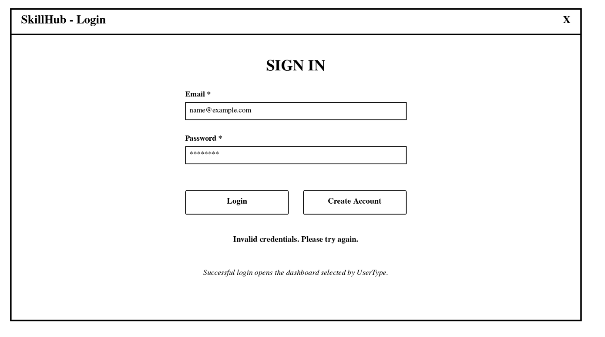 | 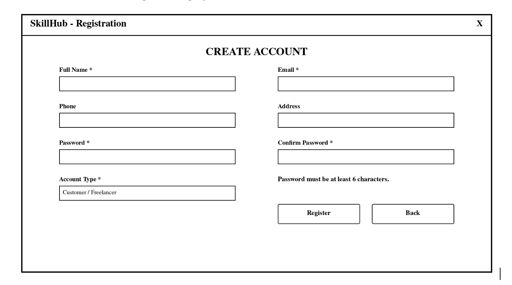 |
| 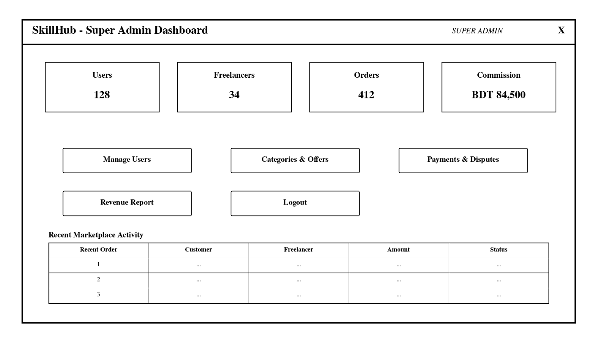 | 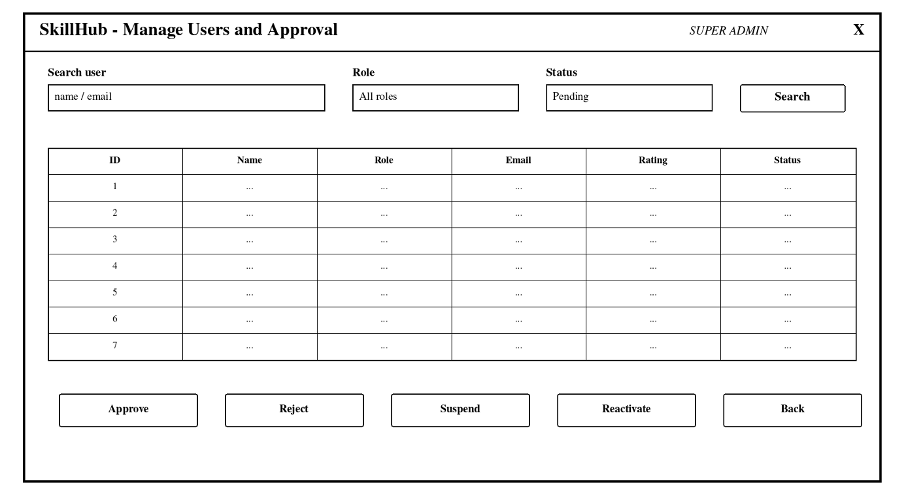 |
| 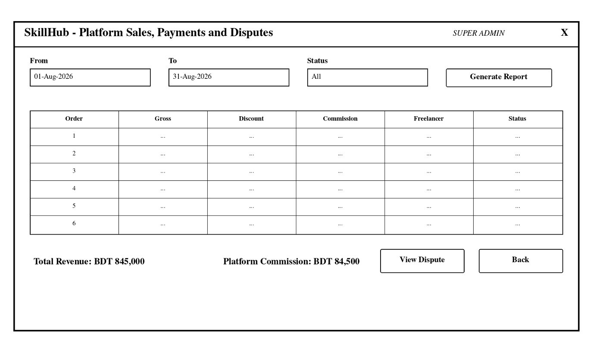 | 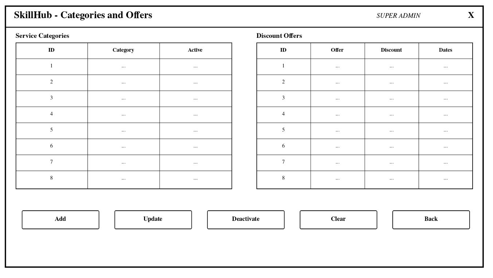 |
| 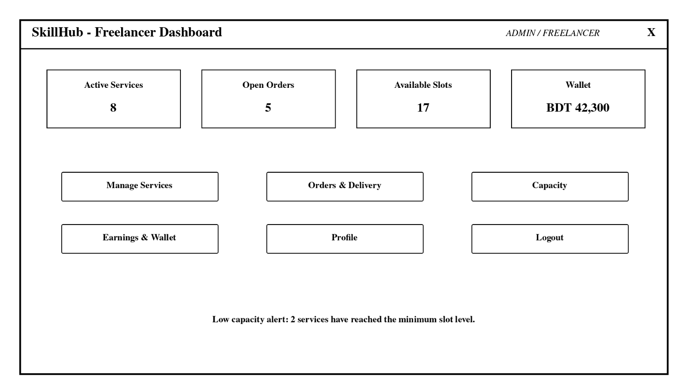 | 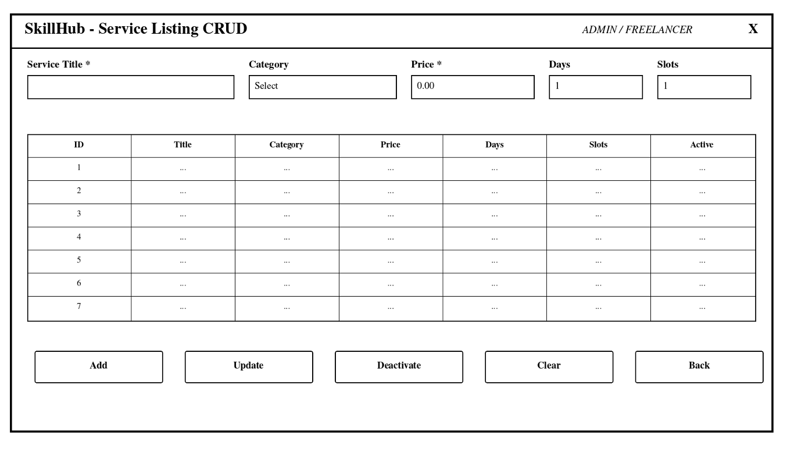 |
| 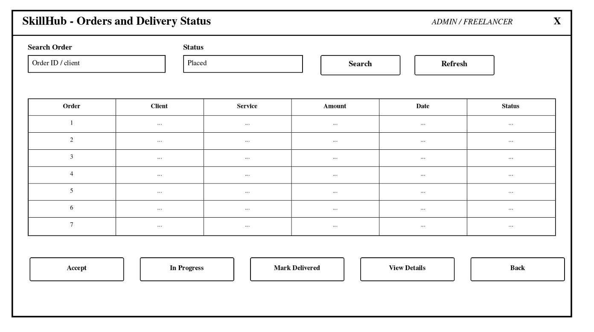 | 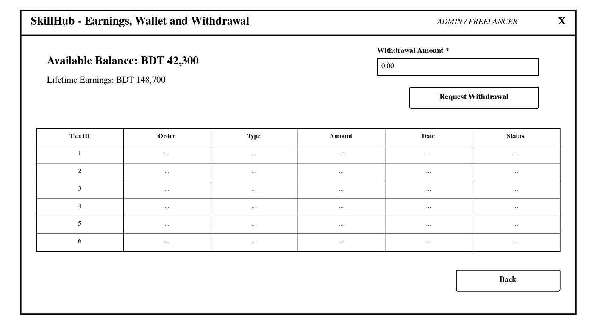 |
| 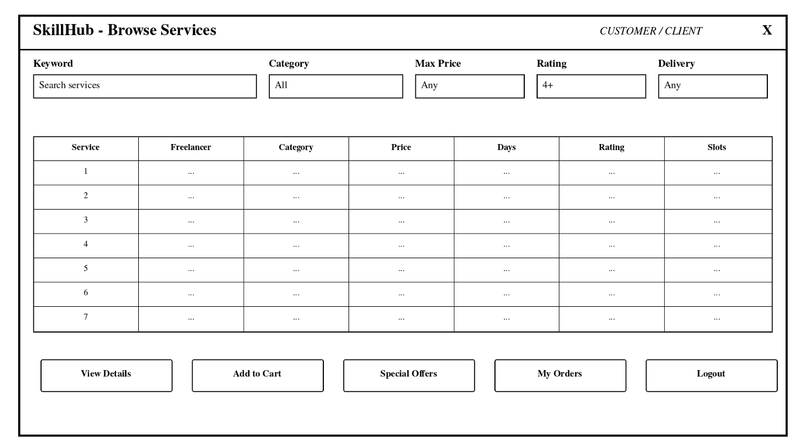 | 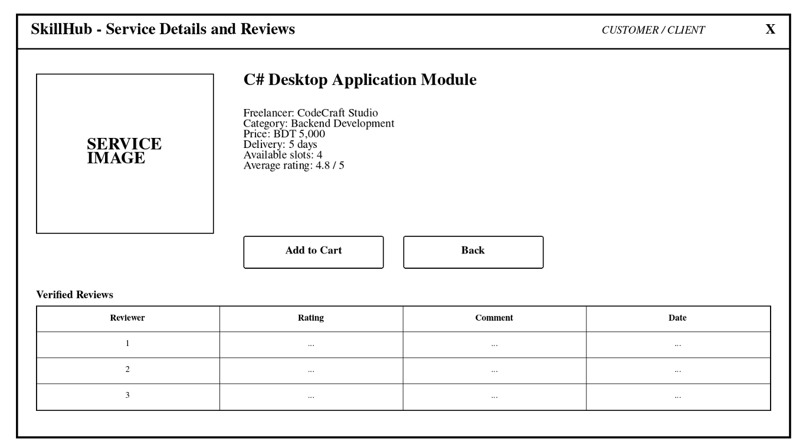 |
| 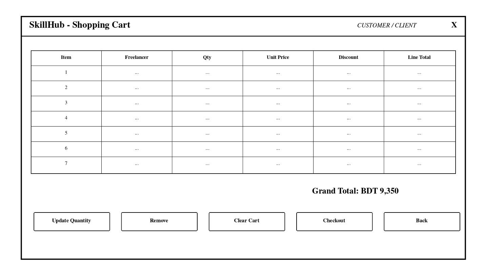 | 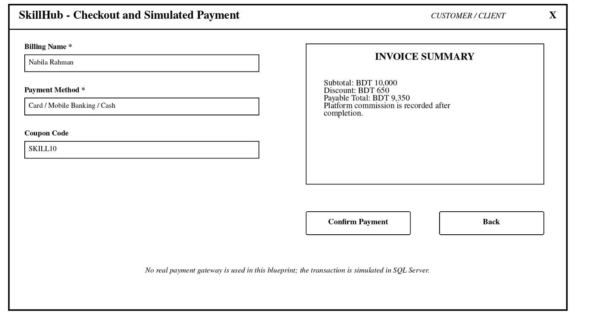 |
| 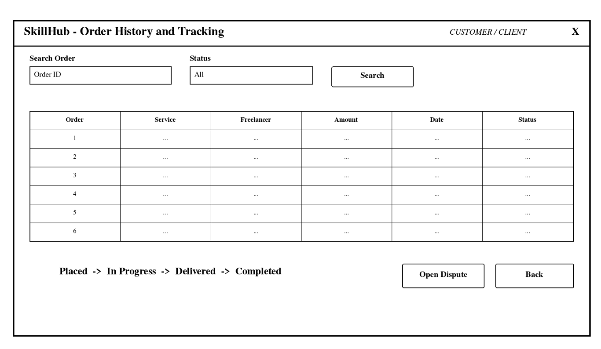 | 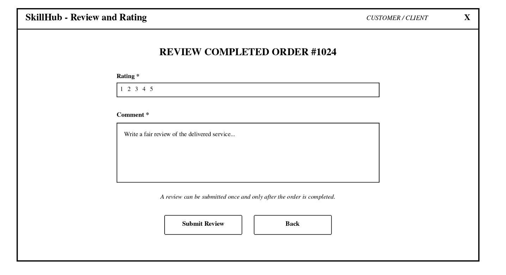 |
| 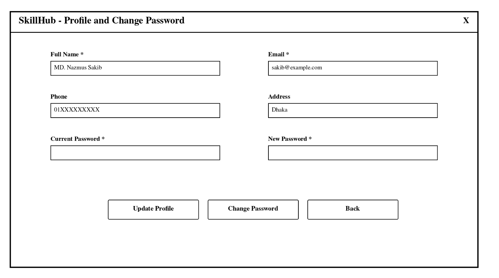 |  |

## Team Members

| Serial | Name | Student ID | Main Contribution |
|---|---|---|---|
| 01 | MD. Nazmus Sakib | 24-58148-2 | Database foundation, schema, SQL planning and integration |
| 02 | Md. Omar Faruk Aumi | 24-59497-3 | Admin and financial module |
| 03 | Sadman Ahmed | 25-62451-2 | Freelancer module |
| 04 | Anika Sumaiya | 24-59063-3 | Client / Customer module |

> Contribution percentages should be entered according to the team's actual agreed workload.

---

## Current Project Status

This repository contains the integrated **working academic implementation** of SkillHub. It includes the SQL Server foundation, role-based authentication, visual service marketplace, freelancer service management, cart and simulated checkout, order workflows, reviews, disputes, wallet functions and SUPER_ADMIN management screens.

The included image assets are local demonstration artwork. The project does not depend on remote image URLs and continues to show generated fallback artwork if an optional user image is missing.

---

## Course Information

- **Course:** CSC2210 – Object Oriented Programming 2
- **Section:** D
- **Project:** SkillHub – Freelance Marketplace Management System
- **Institution:** American International University–Bangladesh (AIUB)

---

## Possible Future Extension

The academic version can later be extended with cloud-hosted storage, real payment-provider integration, email notifications, production identity verification and automated CI testing. Those production services are intentionally outside the current simulated course scope.

---

## Disclaimer

SkillHub is an academic desktop application project. Payment functionality described in the report is simulated for educational purposes and does not represent a real banking or payment-gateway integration.
